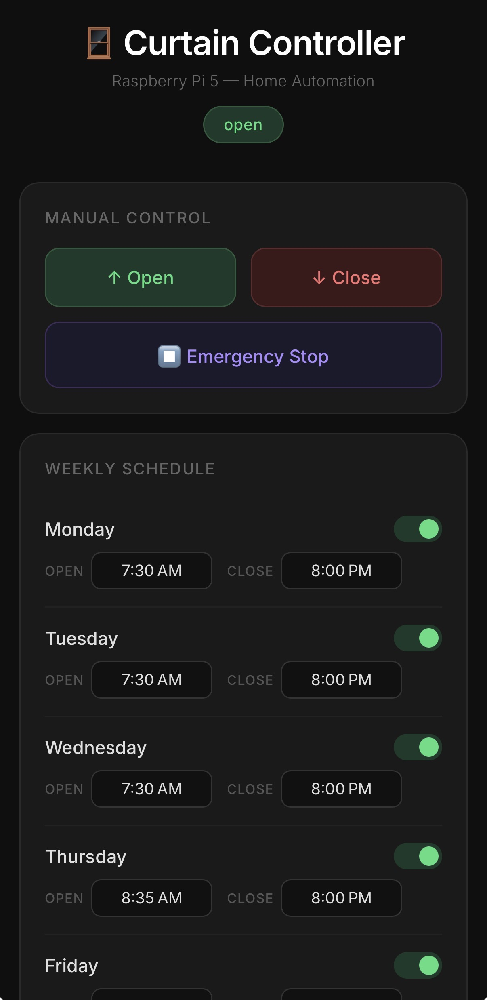

# 🪟 Automated Curtain Controller

A full-stack IoT automation system built on Raspberry Pi 5 that automatically opens and closes curtains on a customizable weekly schedule. Controlled via a Progressive Web App accessible from an iPhone home screen.

## Demo

https://github.com/brennansletten/automated-curtain-controller/raw/main/demo.mp4

## Web App


## Hardware
## Hardware
<table>
  <tr>
    <td></td>
    <td></td>
  </tr>
</table>
## Features
- Weekly schedule with per-day open and close times
- Toggle individual days on or off
- Manual open/close control from iPhone home screen
- Emergency stop button
- Persistent curtain state saved across reboots
- Auto-starts on boot via systemd service
- Dark mode Progressive Web App — installable on iPhone home screen

## Tech Stack
- Python / Flask
- Raspberry Pi 5 (headless Linux)
- GPIO stepper motor control via gpiozero
- GT2 belt and pulley mechanical drive system
- Multithreaded motor control with emergency stop flag
- JSON file-based persistent storage
- Progressive Web App (PWA)

## Hardware Components
- Raspberry Pi 5
- 28BYJ-48 stepper motor
- ULN2003 driver board
- GT2 timing belt and pulleys
- 3D printed motor mount and idler bracket

## Wiring

| ULN2003 Pin | Raspberry Pi Pin |
|---|---|
| IN1 | GPIO17 (Pin 11) |
| IN2 | GPIO18 (Pin 12) |
| IN3 | GPIO27 (Pin 13) |
| IN4 | GPIO22 (Pin 15) |
| VCC | 5V (Pin 2) |
| GND | GND (Pin 6) |

## Setup
1. Flash Raspberry Pi OS Lite (64-bit) to SD card using Raspberry Pi Imager
2. Enable SSH and configure WiFi in Raspberry Pi Imager settings
3. SSH into Pi and create project directory
4. Set up Python virtual environment
5. Install dependencies
6. Configure systemd service for auto-boot on startup
7. Access web interface at http://[pi-ip]:5000

## Dependencies
```bash
pip install flask gpiozero lgpio
```

## Project Structure
